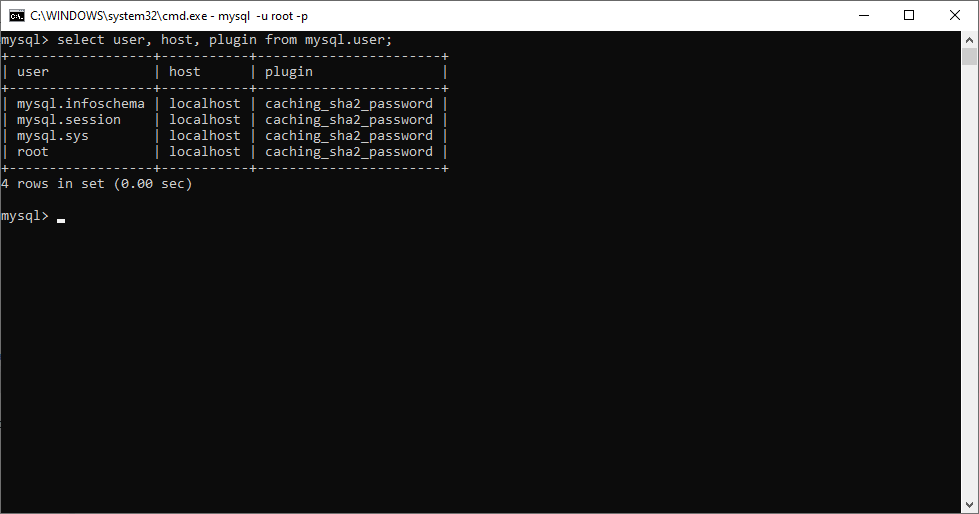

# Comandos principales

1. `Truncate:` Vaciar el contenido de la base de datos
2. `Alter:` Editar la configuracion de la base de datos
3. `Create:` Crear la base datos, las tablas
4. `Drop:` Borrar contenido, tablas, o base de datos

## Tipos de datos

### Enteros

1. `int` o `integer` lo mismo que `2^32` 
2. `smallint` va desde -32768 a 32767
3. `tinyint` va desde -128 a 127
4. `mediumint` es `2^24`
5. `bigint` equivale a `2^64`

### Fixed Points (Excat Value)

1. Decimal
2. Numeric

## Float Points (Aproximate Value)

1. Float
2. Double
> Aqui hay que declararla precisión

`SysBD` - MySql

`SGBD` - Sistema de Gestion de base de datos

> Desde la CMD usamos le comando `mysql -u root -p` y nos permite loguiarnos al servidor de base de datos de mysql


> Los comando de SQL todos terminan en `;`

> Limpiar la consola de mysql `system cls`

## Consulta en la base de datos

```SQL
SELECT user, host, plugin FROM mysql.user;
```



## Crear base de datos

```SQL
CREATE DATABASE <nombre>;
```


> En este comnado creamos una base de datos llamada `pepito`

## Ver databases en el servidor

```SQL
SHOW DATABASES;
```


> Se puede acceder a cualquier tabla dentro de la base de datos usando la convencion del ``<nombre_de_la_tabla>.<campo>``

> Si se quiere trabajar en una sola base de datos se usa el comando `USE` para no tener que usar constantemente la convencion anterior

```SQL
USE pepito;
```


```SQL
SHOW databases; ---mostrar bases de datos en el mysql

USE pepito; ---Usar database pepito

SHOW tables;  --- mostrar tablas de una base de datos

TRUNCATE nombre_table; --- Borrar los datos de una tabla

ALTER ---Alterar la configuracion de las tablas
```


> script para crear una base de datos y sus tablas

```SQL
---Resolucion del ejercicio 1

DROP DATABASE IF EXISTS tienda_pieza;
CREATE DATABASE tienda_pieza charset utf8mb4;
USE tienda_pieza;


CREATE TABLE categoria (
    codigo INT UNSIGNED AUTO_INCREMENT PRIMARY KEY,
    nombre VARCHAR(100) NOT NULL UNIQUE
);

CREATE TABLE pieza (
    codigo INT UNSIGNED AUTO_INCREMENT PRIMARY KEY,
    nombre VARCHAR(120) NOT NULL,
    color VARCHAR(25) NOT NULL,
    precio DECIMAL(7 , 2 ),
    codigo_categoria INT UNSIGNED NOT NULL,
    FOREIGN KEY (codigo)
        REFERENCES categoria (codigo)
);

CREATE TABLE proveedor (
    codigo INT UNSIGNED AUTO_INCREMENT PRIMARY KEY,
    nombre VARCHAR(100) NOT NULL,
    direccion VARCHAR(150) not null,
    ciudad VARCHAR(50) not null,
    provincia VARCHAR(50) not null
);

CREATE TABLE proovedor_suministra_pieza (
    id INT UNSIGNED AUTO_INCREMENT PRIMARY KEY,
    codigo_proovedor INT UNSIGNED,
    codigo_pieza INT UNSIGNED,
    fecha DATE NOT NULL,
    cantidad INT UNSIGNED NOT NULL,
    FOREIGN KEY (codigo_proveedor) REFERENCES proveedor(codigo),
    FOREIGN KEY (codigo_pieza) REFERENCES pieza(codigo)
);
```