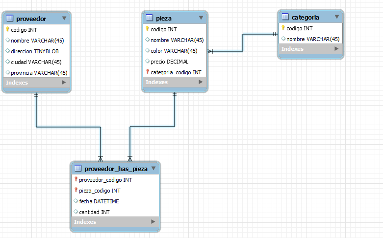

# Resolución de ejercicios de modelo E/R a Modelo Lógico


```SQL
PROVEEDOR(codigo INT, nombre VARCHAR, direccion VARCHAR, ciudad VARCHAR, provincia, VARCHAR)

CATEGORIA(codigo INT, nombre VARCHAR)

PIEZA (codigo INT, nombre VARCHAR, color VARCHAR, precio FLOAT, categoria INT) codigo_pieza FOREIGN KEY CATEGORIA (codigo)

PROVEEDOR_PIEZA(codigopp INT, codigo_proveedor INT, codigo_pieza INT, fecha DATETIME, cantidad INT)

```

