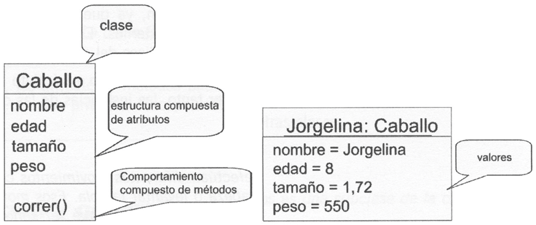
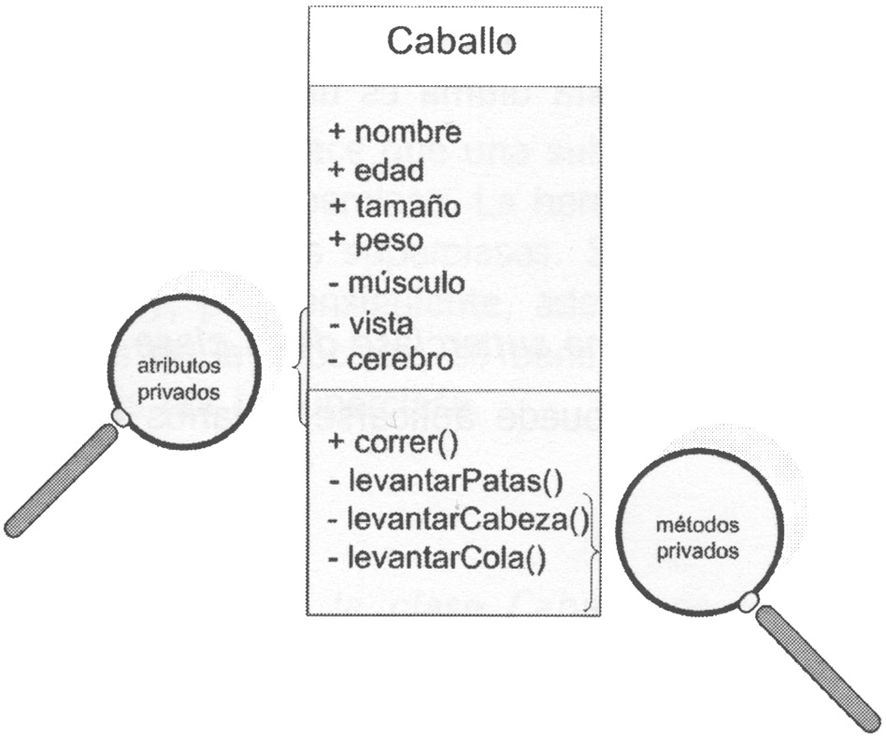
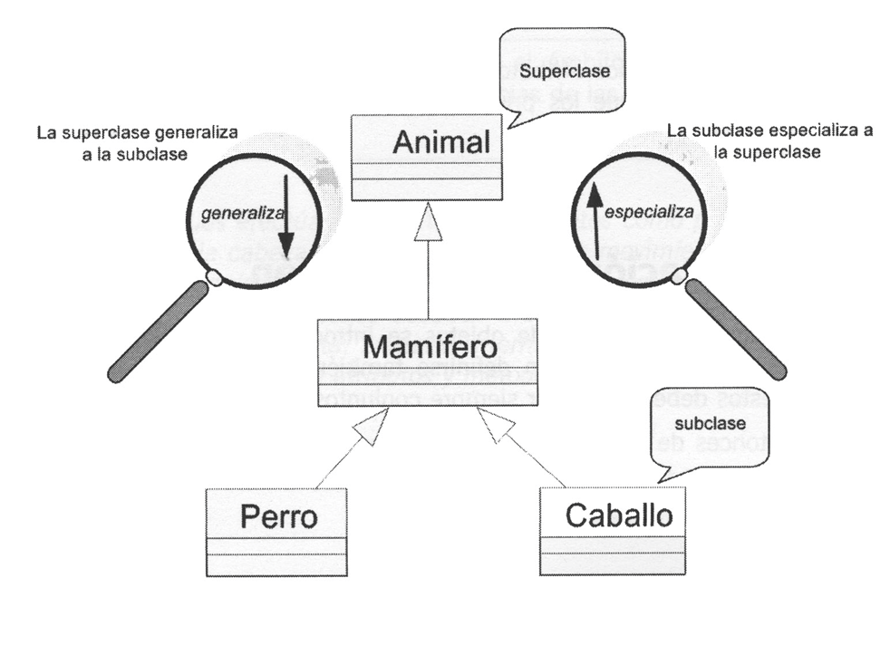
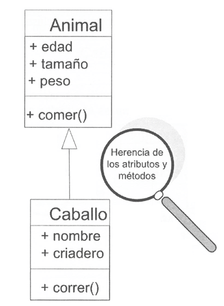
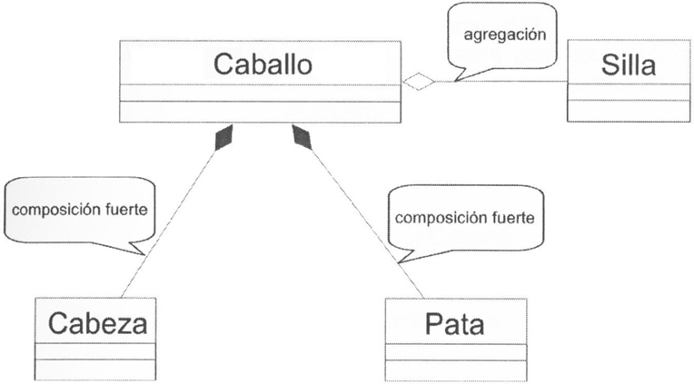
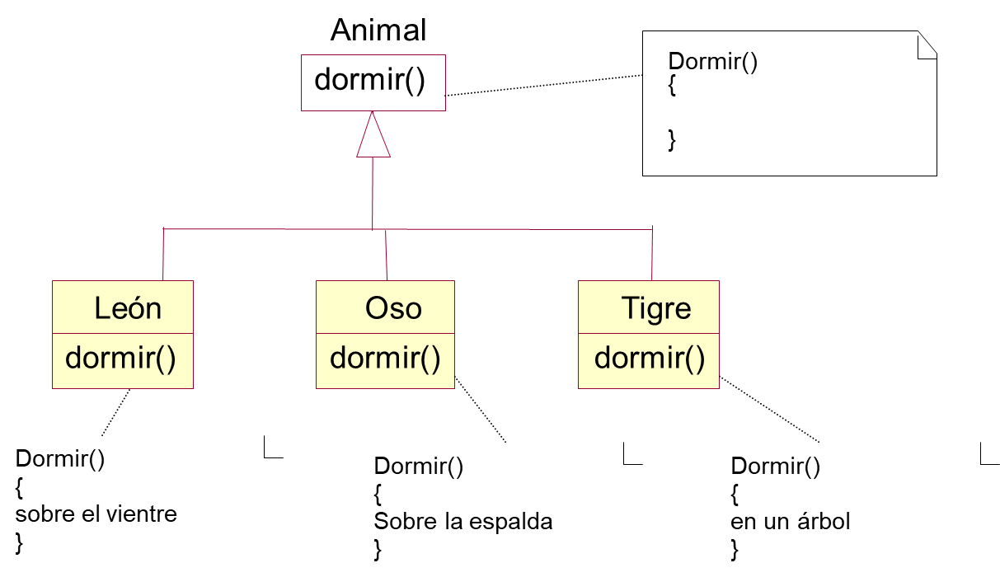

# UML: Unified Modeling Language

Objeto: 
- Unidad del mundo real o abstracta, puede ser cualquier cosa.
- Se representa por un rectángulo.
- Posee un conjunto de atributos y un conjunto de metodos

Atributo: (definen al objeto)
- Variable destinada a recibir un valor.

Metodo: (Accioones que realiza el objeto)
- Instrucciones que toman unos valores de entrada y producen un resultado.

## Clase
```javascript
class Carro{
    color: string,
    marca: string,
    modelo: string,
    marchas: number
  }
```

## Objeto
```javascript
carro1: Carro={
    color: azul,
    marca: Mazda,
    modelo: CX3,
    marchas: 6
}
```


## Encapsulación
Propiedad de la orientación a objeto, que permite ocultar los atributos y métodos del objeto a otros

Se representa con `+` los publicos y `-` los privados



## Especialización y generalización

Especialización se refiere a una super clase que contiene a clases inferiores

> Una superclase seria animal que contiene subclases como mamiferos, aves. Mamiferos puede ser superclases de subclases como felinos, equinos. Usando el recurso `es una` podemos definir las superclases



## Herencia

La herencia es la propiedad que hace que una subclase se beneficie de la estructura y del comportamiento de su superclase. La herencia deriva del hecho de que las subclases son subconjuntos de las superclases. Sus instancias son asimismo instancias de la superclase y, por consiguiente, además de la estructura y del comportamiento introducidos en la subclase, se benefician también de la estructura y comportamientos definidos por la superclase.



## Composición

Objeto puede estar compuesto por otros objetos. Los objetos que forman el objeto se le llaman componentes. Pueden ser debiles o fuertes.



En la composición débil, los componentes pueden ser compartidos por varios objetos complejos. En la composición fuerte, los componentes no pueden compartirse y la destrucción del objeto compuesto conlleva la destrucción de sus componentes.

## Poliformismo

Permite que los metodos heredados por los hijos mediante la herencia, pueden ser modificados localente en las subclases.

