# Diagrama de clases

- Es el diagrama principal para el análisis y diseño del sistema
- Es un tipo de diagrama estático que describe la estructura de un sistema mostrando sus clases y las asociaciones entre ellas

## Composición

- Clases: atributos, métodos y visibilidad.
- Relaciones: asociación, herencia, agregación/composición, generalización/es	pecialización.

## Notación gráfica

En UML, una clase se representa por un rectángulo que posee `tres divisiones`:

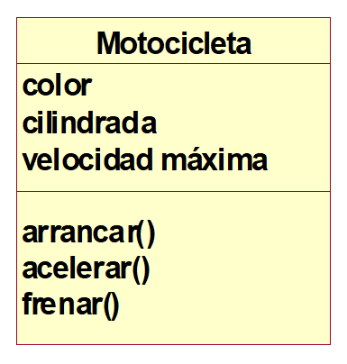

- Nombre de la clase.				
- Atributos de la clase.
- Métodos(operaciones de la clase)

> Aunque no existan métodos en la clase, se debe reflejar disponible el espacio de los métodos

En la representación de una clase los atributos y métodos pueden omitirse. Por defecto la visibilidad de los atributos debe ser `private` y la de los métodos `public`.

## Encapsulación

La encapsulación es el proceso de ocultar los atributos y métodos de un objeto a otros objetos.

### Ventajas

- Se protegen los datos de accesos indebidos.
- Favorece la modularidad y el mantenimiento.


### Representación

Con el signo `+` se representan los métodos públicos.
Con el signo `-` se representan los métodos privados.

## Atributos

Un atributo representa alguna propiedad de la clase que se encuentra en todas las instancias de la clase. Ejemplo de atributos son: Nombre, Salario, Código, Teléfono, etc. 

Al crear los atributos se indicará el tipo de dato y también su visibilidad con el entorno: público, protegido o privado.

## Métodos

Un método, también llamado operación, es la implementación de un servicio de la clase que muestra un comportamiento común a todos los objetos. Definen la forma de cómo la clase interactúa con su entorno

Igual que los atributos, los métodos también pueden ser: `públicos`, `protegidos` o `privados`.

## Relaciones

En el mundo real muchos objetos están vinculados o relacionados entre sí, los vínculos se corresponden con asociaciones entre los objetos. En UML, estos vínculos se describen mediante asociaciones.

### Formas de relación

- Asociación, composición y agregación.
- Herencia: generalización / especialización.


### Asociación

 La asociación expresa una conexión bidireccional entre objetos.

 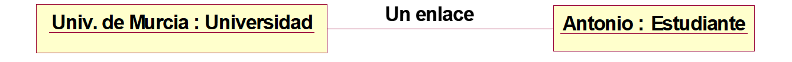

 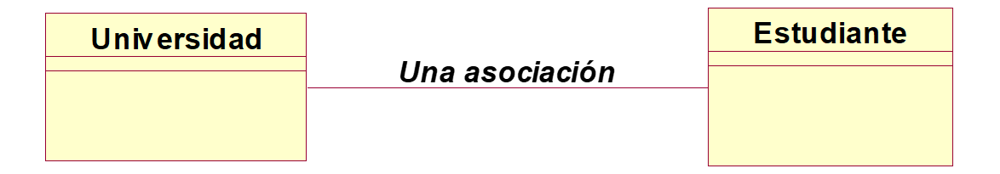

-  La asociación posee una cardinalidad llamada multiplicidad que representa el número de instancias de una clase que se relacionan con las instancias de otras clases.
- En uno de los extremos de la asociación, es posible especificar la multiplicidad mínima y máxima.

Para expresar las multiplicidades mínimas y máximas se utiliza la siguiente notación:

```MarkDown
1			Uno y sólo uno
0..1		Cero o uno
M..N	    Desde M hasta N (enteros naturales)
*			Cero o muchos
0..*		Cero o muchos
1..*		Uno o muchos (al menos uno)
```

`Ejemplo 1:` En el primer ejemplo se muestra la asociación suministra entre Proveedor y Artículo, un proveedor suministra 0 o muchos artículos. Un artículo es suministrado por un proveedor.

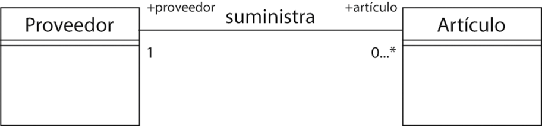


`Ejemplo 2:` Asociación tutoriza entre Tutor y Curso, un tutor tutoriza un curso, y un curso es tutorizado por un tutor, es una asociación 1 a 1.

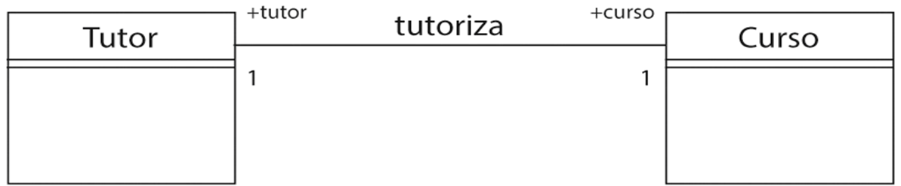

Una clase puede asociarse consigo misma creando una asociación reflexiva. Estas asociaciones unen entre sí instancias de una misma clase.

`Ejemplo 3:` En la siguiente figura se muestran dos asociaciones reflexivas, un alumno (delegado) es delegado de muchos alumnos y un empleado (jefe) es jefe de muchos empleados.

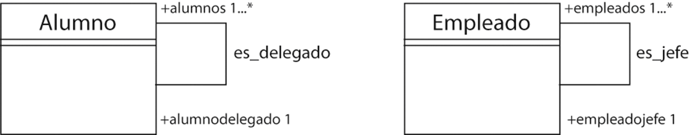

## Composición 

Un objeto puede estar compuesto por otros objetos, en estos casos nos encontramos ante una asociación entre objetos llamada `Asociación de Composición`. Ésta asocia un objeto complejo con los objetos que lo constituyen, es decir, sus componentes. 

Existen dos formas de composición, `fuerte` o `débil`. La `fuerte` se la conoce como `composición` y la `débil` se la conoce como `agregación`.

En la `composición fuerte` los componentes constituyen una parte del objeto compuesto, y éstos no pueden ser compartidos por varios objetos compuestos.  La supresión del objeto compuesto comporta la supresión de los componentes.

Se representa por una línea con un rombo relleno:


En la siguiente figura se muestra la asociación de composición entre un ordenador y sus partes. Se considera que el ordenador se compone de una placa base, una o varias memorias, un teclado y uno o varios discos.

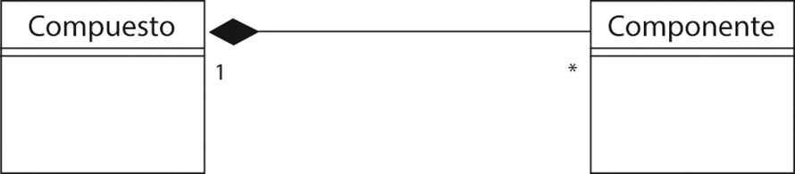

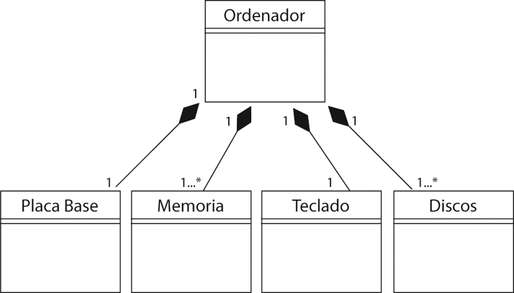

La `agregación` es la `composición débil`, en este caso los componentes pueden ser compartidos por varios compuestos y la destrucción del compuesto no implica la destrucción de los componentes.  La agregación se da con mayor frecuencia que la composición.

Se representa por un línea con un rombo vacío:

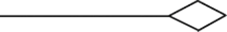

En la siguiente figura se muestra la asociación de agregación entre una clase Equipo, y la clase Jugador. Un equipo está compuesto por jugadores, sin embargo, el jugador puede jugar también en otros equipos. Si desaparece el equipo, el jugador no desaparece

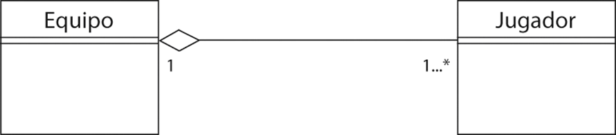

## Generalización

- Las clases con atributos y operaciones comunes se pueden organizar de forma jerárquica, mediante la herencia.
- La generalización define una relación entre una clase más generalizada, y una o más versiones refinadas de ella.
- La generalización indica que una clase (`clase secundaria o subclase`) hereda los `atributos` y `métodos` de otra (`clase principal o superclase`). 
>La superclase generaliza a sus subclases, y las subclases especializan a la superclase.
- Nombres usados: `clase padre - clase hija`. Otros nombres: `superclase - subclase`, `clase base - clase derivada`

Para representar esta asociación se utiliza una flecha
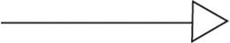

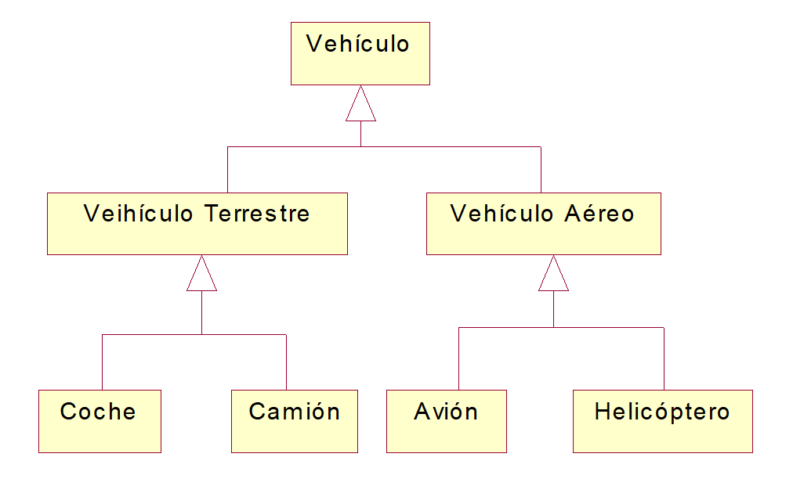

## Especializacón

UML ofrece cuatro especificaciones sobre la herencia entre una superclase y sus subclases

- `Total` {complete}: significa que el conjunto de las subclases está completo y cubre la superclase.
- `Parcial` {incomplete}: significa que el conjunto de subclases está incompleto y no cubre la superclase.
- `Disjunta` {disjoint}: significa que las subclases no tienen ninguna instancia en común.
- `No disjunta `{overlapping}: significa que las subclases pueden tener una o varias instancias en común.


## Polimorfismo 

- El término polimorfismo se refiere a que una característica de una clase puede tomar varias formas en las subclases.
- El polimorfismo representa en nuestro caso la posibilidad de desencadenar operaciones distintas en respuesta a un mismo mensaje.
- Cada subclase hereda las operaciones pero tiene la posibilidad de modificar localmente el comportamiento de estas operaciones.


`Ejemplo: ` todo animal duerme, pero cada clase lo hace de forma distinta.

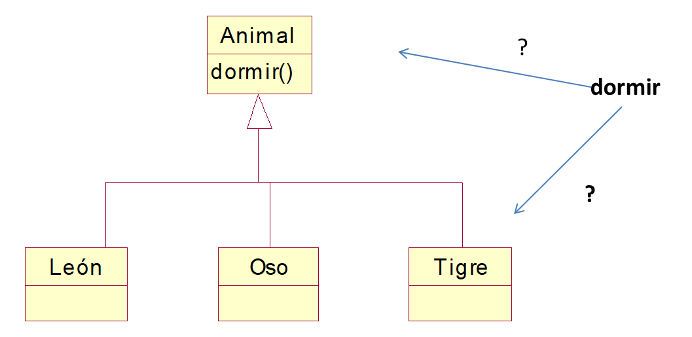

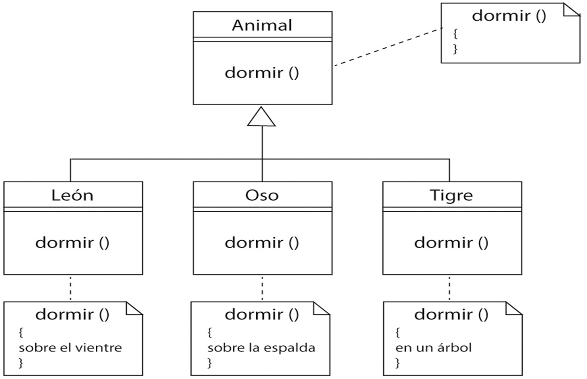