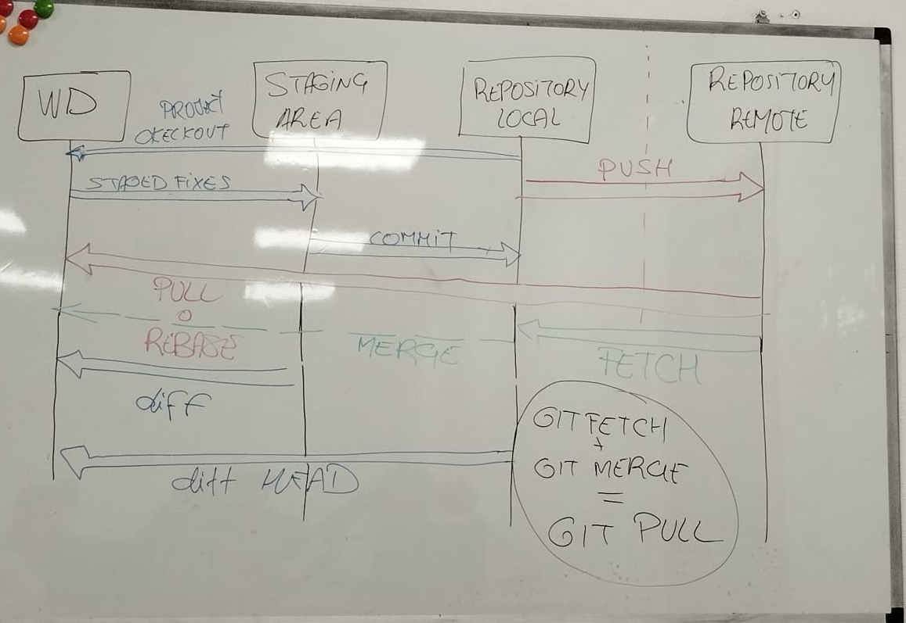

# Introducción a GIT


## Ruta de trabajo para GIT


## WD -  Carpeta de Trabajo

https://education.github.com/git-cheat-sheet-education.pdf

```GIT
git init //Inicializo el repositorio local

git status //Nos muestra como esta el status del repositorio

git add . //Poner lo ficheros listos para hacerle una foto

git commit - m "" //Se crea el snapshot de los archivos guardados en el repositorio

```

Estados de los ficheros

**ADD** - Untracked a Stage
**EDIT FILE** - Unmodified a Modified
**REMOVE FILE** - Unmodified a untracked
**STAGE** - Modified a Stage
**COMMIT** -  Stage a Unmodified 


