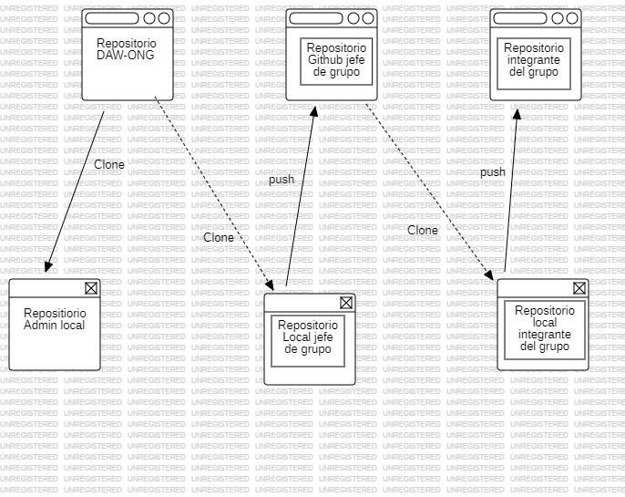
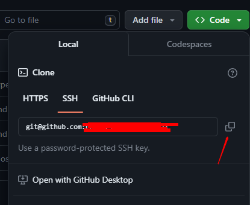
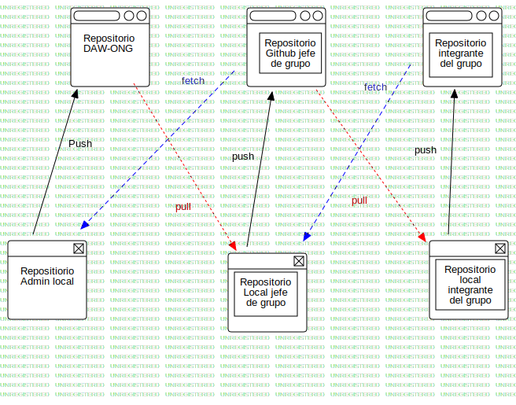

# Flujo de trabajo para el proyecto

## Primeros pasos



1. El encargado de organizar el proyecto crea un repositorio en el Github (https://github.com)
2. El encargado del proyecto se clona el repositorio en su computadora , desde donde realizara el control final de las versiones del producto a desarrollar

```BASH
git clone <nombre repositorio>
```

3. El responsable del grupo crea un repositorio personal en Github(https://github.com)
4. El responsable del grupo clona en su computadora personal el repositorio del administrador del proyecto (Creado en el paso 1)
5. El responsable del grupo comprueba los enlace remotos que tiene en su repositorio local

```BASH
git remote -v
```

> 📢  **Nota:** En este punto comprobara que los enlaces remotos que tiene en su repositorio de trabajo local no corresponden con los de su repositorio en github (creados en el paso 3)

Obtendra por consola 2 enlaces:
```BASH
origin  git@github.com:<repositorio del admin del proyecto(paso 1)> (fetch)
origin  git@github.com:<repositorio del admin del proyecto(paso 1)> (push)
```

6. El responsable del grupo debe renombrar estas ligas con referencia `origin` a otro nombre que le resulte facil recordar

```BASH
git remote rename origin <nueva referencia>
```

> 📢 **Nota:**  En este punto el responsable del grupo aún no tiene referencia con el repositorio personal creado por él en github (paso 3).
El responsable del grupo debe adicionar la liga `origin` que lo conecta a su repositorio wn github

7. El responsable del grupo se dirige a la página de Github (https://github.com) y busca en sus repositorios personales el que creo en el paso 3.
8. Hace click en el botón verde `<> Code` y copia la dirección de su repositorio personal



9. El responsable del grupo en la terminal de git, en la carpeta del proyecto que clono (paso 4), procede a adicionar esta liga de enlace a su repositorio en github

```BASH
git remote add origin <enlace copiado en el botón verde de github>
```

10. Comprueba las ligas a repositorios remotos.

```BASH
git remote -v
```

Obtendra por consola 4 enlaces:
```BASH
origin  git@github.com:<repositorio personal(paso 4)> (fetch)
origin  git@github.com:<repositorio personal(paso 4)> (push)
<nueva referencia (paso 6)>  git@github.com:<repositorio del admin del proyecto(paso 1)> (fetch)
<nueva referencia (paso 6)>  git@github.com:<repositorio del admin del proyecto(paso 1)> (push)
```

11. El responsable del grupo procede a realizar un push del repositorio clonado (paso 4) desde el administrador del proyecto hacia su repositorio en Github

```BASH
git push origin
```
>📢**Nota:** En este punto el responsable del grupo tendrá una copia exacta del repositorio del administrador del proyecto, tanto en su repositorio local como en el de github

## ¿Como actuarían los colaboradores que pertenecen a cada grupo?

1. El integrante del grupo clonaría el repositorio del responsable del equipo correspondiente (Paso 3. Sección anterior)
2. El integrante del grupo crearía en Github(https://github.com) un repositorio personal
3. El integrante del grupo comprueba los enlace remotos que tiene en su repositorio local


> 📢  **Nota:** En este punto comprobará que los enlaces remotos que tiene en su repositorio de trabajo local no corresponden con los de su repositorio en github (creado en el paso 2, de esta sección)

```BASH
git remote -v
```
> 📢  **Nota:** En este punto comprobara que los enlaces remotos que tiene en su repositorio de trabajo local no corresponden con los de su repositorio en github (creados en el paso 3)

Obtendra por consola 2 enlaces:
```BASH
origin  git@github.com:<repositorio del responsable del equipo>(paso 1)> (fetch)
origin  git@github.com:<repositorio del responsable del equipo>(paso 1)> (push)
```

4. El colaborador debe renombrar estas ligas con referencia `origin` a otro nombre que le resulte facil recordar

```BASH
git remote rename origin <nueva referencia>
```

> 📢 **Nota:**  En este punto el colaborador aún no tiene referencia con el repositorio personal creado por él en github (paso 2, de esta sección).
El colaborador debe adicionar la liga `origin` que lo conecta a su repositorio wn github

7. El colaborador se dirige a la página de Github (https://github.com) y busca en sus repositorios personales el que creo en el paso 2 de esta sección.
8. Hace click en el botón verde `<> Code` y copia la dirección de su repositorio personal


9. El colaborador en la terminal de git, en la carpeta del proyecto que clono (paso 1, de esta sección), procede a adicionar esta liga de enlace a su repositorio en github

```BASH
git remote add origin <enlace copiado en el botón verde de github>
```

10. Comprueba las ligas a repositorios remotos.

```BASH
git remote -v
```

Obtendra por consola 4 enlaces:
```BASH
origin  git@github.com:<repositorio personal(paso 4)> (fetch)
origin  git@github.com:<repositorio personal(paso 4)> (push)
<nueva referencia (paso 6)>  git@github.com:<repositorio del responsable del grupo(paso 1)> (fetch)
<nueva referencia (paso 6)>  git@github.com:<repositorio del responsable del grupo(paso 1)> (push)
```

11. El colaborador procede a realizar un push del repositorio clonado (paso 4) desde el administrador del proyecto hacia su repositorio en Github

```BASH
git push origin
```
>📢**Nota:** En este punto el colaborador tendrá una copia exacta del repositorio del responsable del grupo, tanto en su repositorio local como en el de github

## ¿Como procedemos en el día a día?



1. Un colaborador **X** comienza a realizar un nuevo dia de trabajo donde no ha realizado cambios a su código
2. Estando en la rama `main` de su repositorio local realiza un `git pull <referencia al repo del responsable del grupo>` (paso 10, sección anterior) y obtiene las ultimas actualizaciones que su jefe de grupo tiene implementado en la rama `main`
3. Crea una rama de trabajo nueva donde realizará nuevas implementaciones al código

```BASH
git checkout -b <nombre de la rama nueva>
```

> 📢 **Nota:** Con este comando git nos creara en nuestro repositorio local una nueva rama y automáticamente cambiara a ella.

4. Realiza todas las adecuaciones necesarias, realizando los commit que necesite para tener un control de las diferentes versiones de su código, recordando que siempre debe escribir un mensaje claro de cuales, donde y porque se hizo el cambio, de forma muy concisa
5. Luego que las nuevas implementaciones estén terminadas, cambia a su rama `main`

```BASH
git checkout main
```

6. Encontrándose en su rama `main` realiza un merge de los cambios realizados en su rama anterior a la rama master de esta manera

```BASH
git merge <nombre de la rama donde están los cambios a implementar>
```

7. Luego de realizados los cambios y comprobar que todo funciona correctamente en su rama main, procede a borrar la rama donde desarrollo los nuevos cambios antes de realizar el merge en la rama `main`

```BASH
git branch -d <nombre de la rama a borrar>
```

8. El colaborador **X** procede a actualizar su repositorio en Github (https://github.com), para esto realiza un `push` de su repositorio local al origin en Github

```BASH
git push origin
```

9. Se pone en contacto con su jefe de grupo y le comunica que ha realizado la tarea indicada y que los cambios se encuentran actualizados en su repositorio de Github y queda a la espera de nuevas indicaciones.

## ¿Como actuaría el jefe de grupo?

El jefe de grupo tiene una tarea muy importante ya que es el eslabón intermedio entre el proyecto final y sus colaboradores.

1. Antes de comenzar su trabajo, verifica que tenga la ultima versión del repositorio principal

```BASH
git pull <repositorio coordinador del proyecto>
```

2. Si tiene una notificacion de alguno de sus colaboradores, crea una rama nueva

```BASh
git checkout -b <nombre rama nueva>
```

> 📢 **Nota:** Con este comando git nos creara en nuestro repositorio local una nueva rama y automáticamente cambiara a ella.

3. Comprobar que tiene adicionada una liga remota que apunte a el repositorio del colaborador

```BASH
# Comprueba las ligas remotas que tiene
git remote -v

# De no contar con la liga remota del colaborador, debe solicitarle cual es la dirección de su repositorio y proceder adicionarla
git remote add <alias de la liga> <dirección del repo del colaborador>
```

4. Estando trabajando en la rama nueva, realiza un `fetch` desde el repositorio del colaborador que trabaja con el

```BASH
git fetch <alias de la liga>
```

5. 


