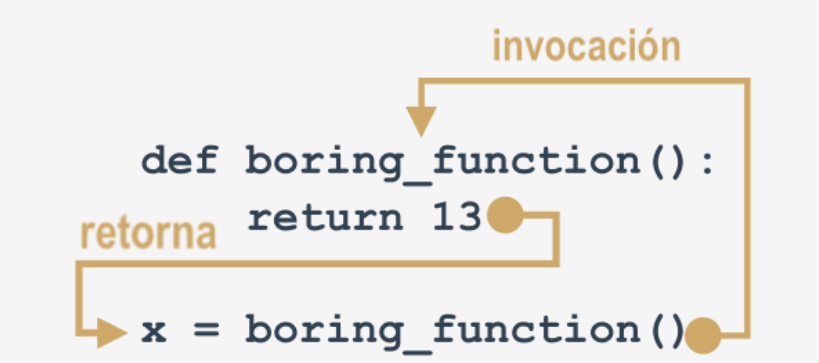

# Funciones

Con el `return` la función regresa a la invocación y se olvida de todo lo que esta detrás de el en la función, es código inalcanzable, se utiliza para terminar la invocación de la función.

>Nota: si una función no está destinada a producir un resultado, emplear la instrucción <strong>return</strong> no es obligatorio, se ejecutará implícitamente al final de la función.

Si no colocamos un `return` o colocamos un `return` sin expresión, nos envía un `none` de respuesta

# Mutabilidad e Inmutabilidad

Los tipos de datos enteros, string, boolean y float son `inmutables` los valores pasan por valor, los datos nuevos ocupan un espacio de memoria diferente.

Las listas de datos son `mutables`, ya que se pasan por referencia, y siempre afectan al objeto inicial

