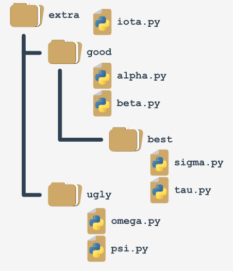
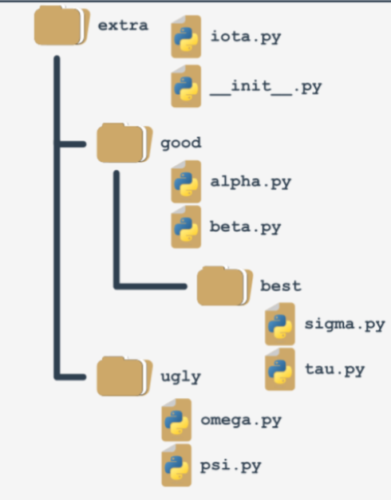

## Importación de paquetes

Se puede realizar de 2 maneras.
- Importando todo el paquete, lo que haría que nuestra aplicación en memoria fuera mas grande
- Importando selectivamente los métodos que necesitamos para el funcionamiento de nuestra aplicación

```python
import <Modulo> #Importamos el modulo completo

from <modulo> import <funcion1>, <funcion2> # Aqui solo importamos los métodos que necesitamos
```

Se puede usar la palabra reservada `as` para renombrar las importaciones de una manera mas simple

```python
import <modulo> as <alias>


from <modulo> import <funcion1> as <alias1>
```
## metodos estandar

> `dir()` nos devuelve una lista de las funciones que están habilitadas en nuestro programa

### Modulo `platform`

`form platform  import platform ` https://docs.python.org/es/3/library/platform.html

|Ejemplos|Descripción|
|:---|:---|
|platform.platform()|Cadena que describe nuestro entorno de trabajo|
|platform.machine()|Retorna el tipo de máquina, por ejemplo '`i386`'. Si no se puede determinar el valor, retorna una cadena vacía.|
|platform.processor()|Retorna el nombre (real) del procesador. E.j. '`amdk6`'.|
|platform.system()|Retorna el nombre del sistema/SO, como '`Linux`', '`Darwin`', '`Java`', '`Windows`'. Si no se puede determinar el valor, retorna una cadena vacía.|
|platform.python_implementation()|Retorna la string identificando la implementación de Python. Algunos valores posibles son: `“CPython”`, `“IronPython”`, `“Jython”`, `“PyPy”`.|
|platform.python_version_tuple()|Retorna la versión de Python como una tupla (major, minor, patchlevel) de cadena, siendo major la versión principal, minor la versión menor y **patchlevel** último parche aplicado.|

> `import os` permite verificar las entidades contenidas en un modulo importado `dir(os)` 

## Creación de nuestros propios módulos

La variable declarada con `_` o con `__` por convención se consideran variables privadas, pero esto no significa que no puedan ser accedidas directamente desde el programa que las importa

Los comentarios usados para la documentación se realizan asi: `""" comentario """`

Los módulos que crearemos en python para ser usados en nuestro programa main deben comenzar asi:
```python
#!/usr/bin/env python3

""" module.py - Un ejemplo de un módulo en Python """
```

Al final de los módulos creados por nosotros se debe colocar esta instrucción:
```python
if __name__ == "__main__":
    print("Yo prefiero ser un módulo, pero puedo realizar algunas pruebas por ti")
```
Esto garantiza que los módulos envíen una señal al usuario de que deben ser corridos desde el programa principal `main.py`, ademas de permitirnos implementar test de nuestras funciones

## Rutas en módulos

```python
import sys
for p in sys.path
    print(p)
```
Este codigo nos devuelve el conjunto de rutas donde puede estar alojado un modulo para que funciones en el programa principal

1. La primera ruta es donde se ejecuta el programa
2. Trata los archivos `.zip` como carpetas, permitiendo compactar nuestros paquetes creados
3. Se pueden adicionar rutas personalizadas al `sys.path` del programa siempre que no estén como subcarpetas del programa `main.py`

```python
path.append('<modulo>') # las adiciona la final del path

path.insert(0, '<modulo>') # Lo inserta en la posición indicada, este caso 0
```

> 📝 **Nota:** Se recomienda el uso de rutas relativas para garantizar la compatibilidad en los diferentes sistemas operativos. Los archivos siempre serán relativos al archivo de ejecución

## Empaquetamiento

Los paquetes se asemejan a los directorios


Para que esta estructura de archivos y carpetas se convierta en un paquete real en necesario utilizar la estructura inicializadora `__init__.py`
Es un archivo que se coloca en el carpeta principal, el cual puede estar en blanco
