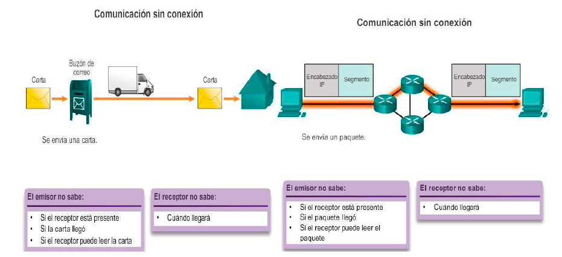
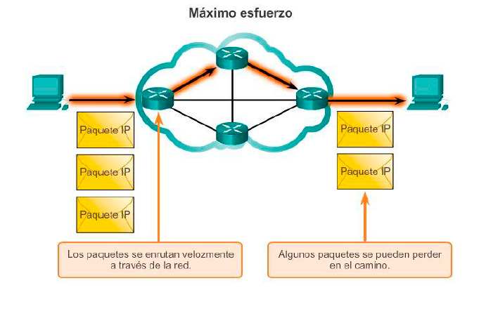
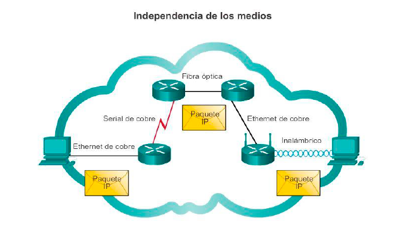
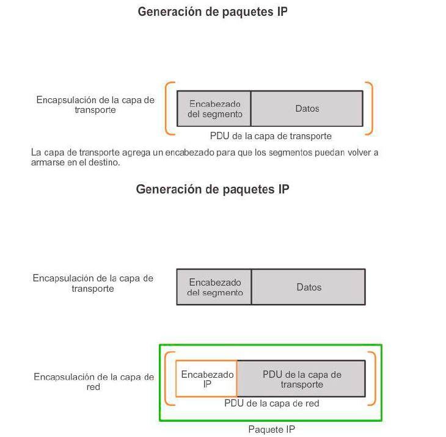
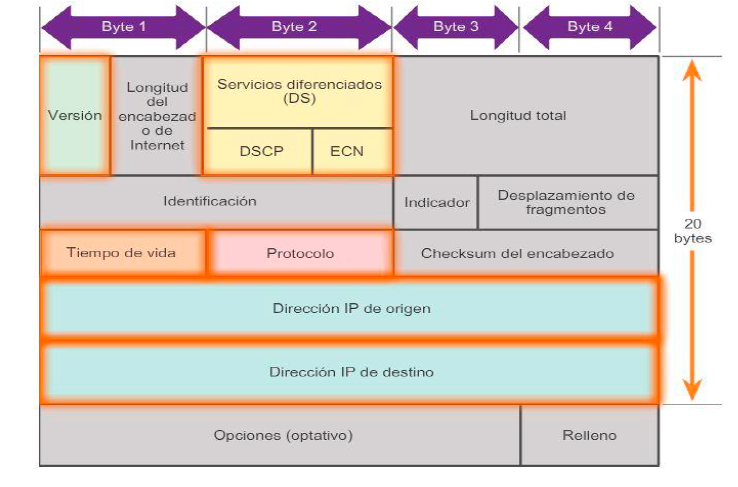
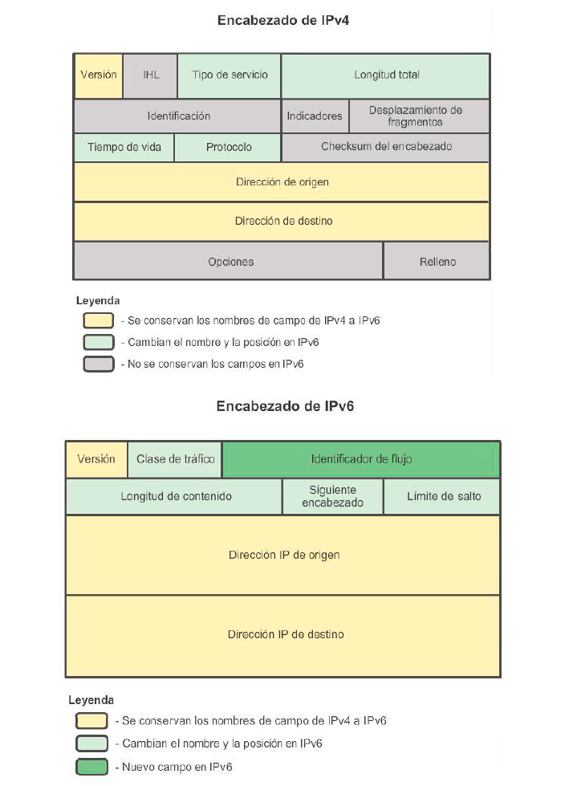
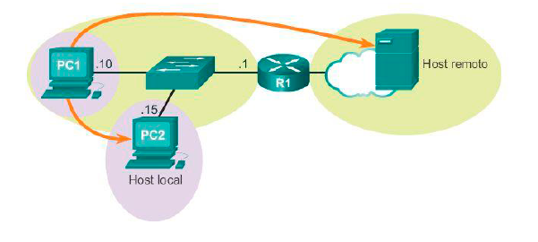
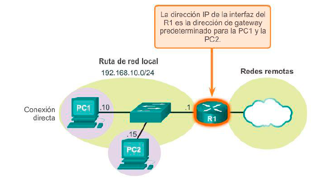
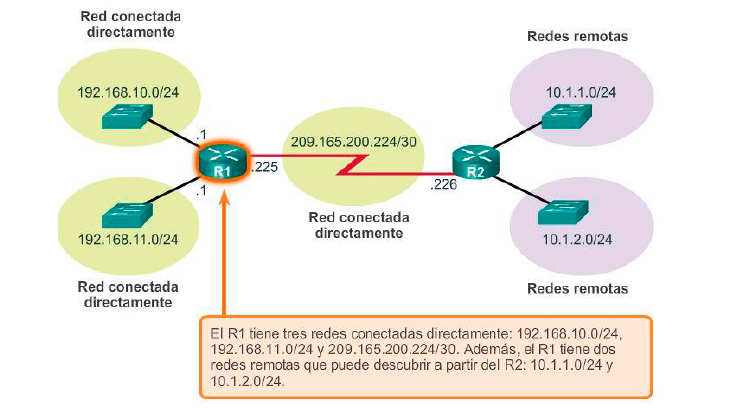

# Capa de red (Capa 3)

Especifican el direccionamiento de los datos de la capa de transporte

`tcp` - transporta
`ip` - enruta

# protocolos de la capa de red

IPv4
IPv6
IPX


# Características del protocolo IP

- **Sin conexión:** no se establece conexión con e destino antes de enviar los paquetes de datos



- **Máximo esfuerzo:** la entrega de paquetes no esta garantizada



- **Independiente de los medios:** la operación es independiente del medio que transporta




Sin embargo, existe una característica importante de los medios que la capa de red tiene en cuenta: el tamaño máximo de la PDU que cada medio puede transportar. `Unidad Máxima de Transmisión (MTU)`

En algunos casos, un dispositivo intermediario, generalmente un router, debe dividir un paquete cuando lo reenvía de un medio a otro con una MTU más pequeña.

## Encapsulación de IP

Los routers pueden implementar estos diferentes protocolos de capa de red para operar al mismo tiempo en una red desde y hacia el mismo host o hosts diferentes. El enrutamiento que realizan estos dispositivos intermediarios solo tiene en cuenta el contenido del encabezado del paquete que encapsula el segmento. En todos los casos, la porción de datos del paquete, es decir, la PDU de la capa de transporte encapsulada, no se modifica durante los procesos de la capa de red.




## Que tienen los paquetes IPv4



**campos mas importantes**
- Dirección IP de origen: contiene un valor binario de 32 bits que representa la dirección IP de origen del paquete.
- Dirección IP de destino: contiene un valor binario de 32 bits que representa la dirección IP de destino del paquete.


### Las mejoras que proporciona IPv6 incluyen lo siguiente

-  Mayor espacio de direcciones: las direcciones IPv6 se basan en un direccionamiento jerárquico de 128 bits, mientras que en IPv4 es de 32 bits. El número de direcciones IP disponibles aumenta drásticamente.
-  Mejora del manejo de los paquetes: el encabezado de IPv6 se simplificó con menos campos. Esto mejora el manejo de paquetes por parte de los routers intermediarios y también proporciona compatibilidad para extensiones y opciones para aumentar la escalabilidad y la duración.
-  Eliminación de la necesidad de NAT: con tal cantidad de direcciones IPv6 públicas, no se necesita traducción de direcciones de red (NAT). Los sitios de los clientes, ya sean las empresas más grandes o unidades domésticas, pueden obtener una dirección de red IPv6 pública. Esto evita algunos de los problemas de aplicaciones debidos a NAT que afectan a las aplicaciones que requieren conectividad de extremo a extremo.
-  Seguridad integrada: IPv6 admite capacidades de autenticación y privacidad de forma nativa. Con IPv4, se debían implementar características adicionales para este fin.

## Encapsulamiento

- El encabezado de IPv4 consta de 20 octetos (hasta 60 bytes si se utiliza el campo Opciones) y 12 campos de encabezado básicos, sin incluir los campos Opciones y Relleno.
- El encabezado de IPv6 consta de 40 octetos (en gran medida, debido a la longitud de las direcciones IPv6 de origen y de destino) y 8 campos de encabezado (3 campos de encabezado IPv4 básicos y 5 campos de encabezado adicionales).



## Decisión de reenvío de host

-  A sí mismo: en este caso, se utiliza una dirección IP especial, 127.0.0.1, que se denomina “interfaz loopback”. Esta dirección de loopback se asigna automáticamente a un host cuando se ejecuta TCP/IP. La capacidad de un host de enviarse un paquete a sí mismo mediante la funcionalidad de la red resulta útil para realizar pruebas. Cualquier dirección IP dentro de la red 127.0.0.0/8 se refiere al host local.
-  A un host local: un host en la misma red que el host emisor. Los hosts comparten la misma dirección de red.
-  A un host remoto: un host en una red remota. Los hosts no comparten la dirección de red.



## Gateway predeterminado

El gateway predeterminado es el dispositivo que enruta el tráfico desde la red local hacia los dispositivos en las redes remotas. En un entorno doméstico o de pequeña empresa, el gateway predeterminado se suele utilizar para conectar la red local a Internet.

> ¿Cómo decide un host si debe o no debe reenviar paquetes al gateway predeterminado?

Los hosts deben poseer una tabla de enrutamiento local propia para asegurarse de que los paquetes de la capa de red se dirijan a la red de destino correcta

- Conexión directa: se trata de una ruta a la interfaz loopback (127.0.0.1).
- Ruta de red local: la red a la cual está conectado el host se completa automáticamente en la tabla de enrutamiento del host.
- Ruta predeterminada local: la ruta predeterminada representa la ruta que los paquetes deben seguir para llegar a todas las direcciones de redes remotas. La ruta predeterminada se crea cuando hay una dirección de gateway predeterminado en el host. La dirección de gateway predeterminado es la dirección IP de la interfaz de red del router que está conectada a la red local. La dirección de gateway predeterminado se puede configurar en el host de forma manual o se puede descubrir de manera dinámica.



```MsDos
netstat -r

route print
```
 ## Decisión de reenvío de paquetes del router

 

 La tabla de enrutamiento de un router almacena información sobre lo siguiente:
- Rutas conectadas directamente: estas rutas provienen de las interfaces del router activas. Los routers agregan una ruta conectada directamente cuando se configura una interfaz con una dirección IP y se activa. Cada una de las interfaces del router se conecta a un segmento de red diferente. En la tabla de enrutamiento, los routers mantienen información acerca de los segmentos de red a los que están conectados.
- Rutas remotas: estas rutas provienen de las redes remotas conectadas a otros routers. El administrador de red puede configurar las rutas a estas redes de forma manual en el router local, o estas se pueden configurar de forma dinámica habilitando al router local para que intercambie información de enrutamiento con otros routers mediante protocolos de enrutamiento dinámico.

La tabla de enrutamiento de un router es similar a la tabla de enrutamiento de un host.


